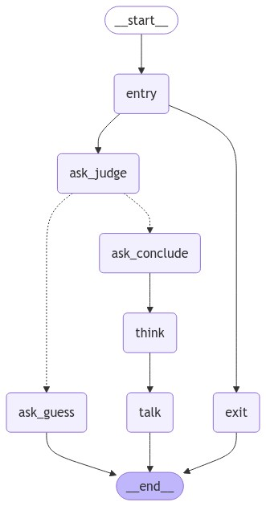

基于[LangGraph](https://langchain-ai.github.io/langgraph/)实现的，可通过yaml配置文件直接生成可执行Agent图的框架。

Agent通过yaml配置文件生成，因此执行逻辑可通过可视化界面(比如yEd)进行编辑，编辑后保存的文件可处理成yaml文件即可。

## Project Structure 
```
graph_agent
├── README.md
├── examples
│   └── graphml_agent
│       ├── agent.py
│       └── configs
│           ├── agent.graphml
│           ├── agent.png
│           ├── agent.yaml
│           ├── agent_ori.yaml
│           └── agent_yed.png
├── requirements.txt
└── src
    ├── __init__.py
    ├── graph.py
    ├── nodes.py
    └── utils.py
```

### src
通过yaml文件生成可执行图的核心代码，支持子图逻辑等。

例如examples/graphml_agent，通过yEd生成graphml文件，再由graphml转为yaml，最终生成可执行Agent。

原始yEd图：
<div align="center">
    
</div>

生成的可执行图：
<div align="center">
    
</div>
